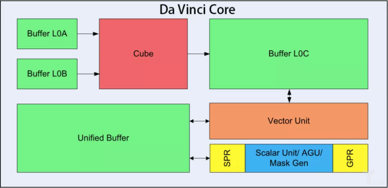
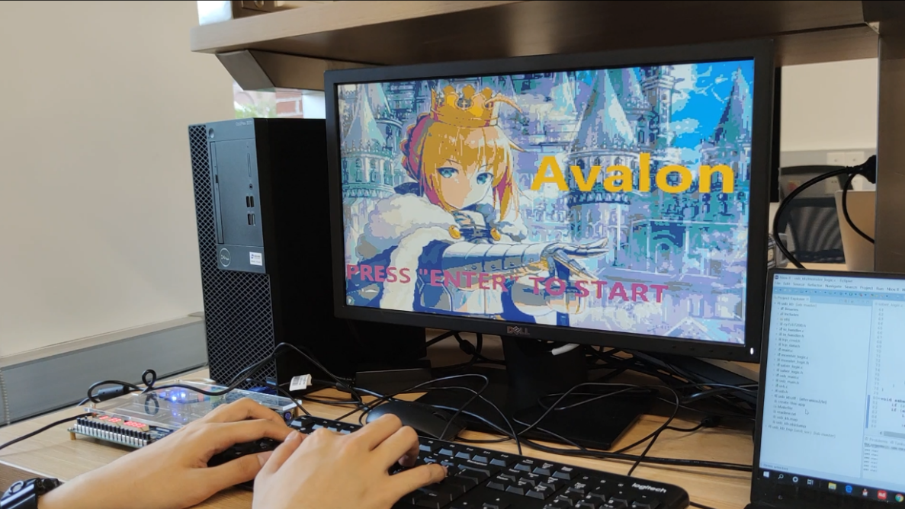

I'm a Senior student at [Zhejiang University/University of Illinois at Urbana-Champaign Institute](https://zjui.intl.zju.edu.cn/).

I major in electronic and computer engineering and am interested in Artificial Intelligence, especially about deep learning. Recently, I am researching on an efficient and accurate method to detect aggressive behavior and human falling by convolutional neural network whith professor [Volodymyr Kindratenko](http://www.ncsa.illinois.edu/People/kindr/).

A version of my CV and transcript can be found here.

[CV](../files/cv.pdf)

[UIUC Transcript](../files/Transcript.pdf)

[ZJU Transcript](../files/Transcript_ZJU.pdf)

Competition Experience
======
Advisor: [Wei Liu](http://www.kthbedc.com/), Assistant Professor of Division of Sustainable Buildings Department of Civil and Architectural Engineering KTH Royal Institute of Technology

Content: 2019 Mathematical Contest in Modeling problem B

The B problem asked teams to select, configure, optimally pack, geoposition, deploy and operate a set of midsize (group 2) unmanned aerial vehicles (UAV) that would supplement existing relief medical supply chains on Puerto Rico. Once beyond identifying effective ‘DroneGo’ system configurations, teams were required to plan flight paths, schedules, and supply lift details throughout the island while conducting visual road reconnaissance and damage assessment to aid disaster relief operations. Implicit to this problem were two NP-hard problems involving 3D container packing optimization, thereby causing teams to adopt clever heuristics to address this aspect of the problem.

[Final paper](../files/mcmthesis-demo.pdf)

Our paper finally get the Outstanding Winners (0.1%) and the Informs Award(0.02%)

[certificate](http://www.comap-math.com/mcm/2019Certs/1908904.pdf)

Selected Projects
======

Deep Learning Models for Human Aggression Detection [[Code]](https://github.com/LinHangzheng/Aggression_Detection)
------
{:height="60%" width="80%"}

* Advisor: [Volodymyr Kindratenko](http://www.ncsa.illinois.edu/People/kindr/), associate professor in the department of Electrical and Computer Engineering (ECE) at the University of Illinois at Urbana-Champaign (UIUC). 

* Created our own dataset which we manually cut and labeled from internet to evaluate their flexibility.

* Reproduced and compared several vision-based neural network models, including Transfer Learning model, conv-LSTM, 3D convolution model, on human aggressive behavior.

* Developed new CNN models, including optical flow based VGG and transfer learning + LSTM models.

Human Falling Detection by Optical  Flow and CNN [[Code]](https://github.com/LinHangzheng/Fall_Detection_Project) 
------
* Advisor: [Volodymyr Kindratenko](http://www.ncsa.illinois.edu/People/kindr/), UIUC

* Developed a Convolutional Neural Network to train a neuro-based model to detect human falling.

* Created our own video data set and analyzed different data stacking patterns on neural network training.

* Implemented an end-to-end human falling detection model by using camera video stream to provide alarm service.

HUAWEI HiSilicon
------
{:height="70%" width="70%"}

* Involved in the Huawei Turing department and participated in the development of Da Vinci chip operators. (The Da Vinci chip is one of the most advanced neural network chips in the world)

* Accelerated the data transmission by optimizing the way to allocate the moving data and to divide data into parts with their corresponding buffer and cache.

* Successfully reduced the transmission delay from 50ms into 3ms.

FPGA based Game Design [[Code]](https://github.com/LinHangzheng/ECE385)
------
{:height="70%" width="70%"} 

Advisor: [Chushan Li](https://person.zju.edu.cn/en/lichushan), Zhejiang University

In the final project, we create a first person 2.5D RPG game “Avalon” by using the DE2-115 board. All the hardware circuit are combined to load the image into the OCM and determine which color of each pixel should be shown on the monitor. The SOC code will do all the game logic, like the key control of the character “Saber” to let her move, attack, block, and use the skill. In addition, SOC will also determine whether each pattern exists on the screen and which frame should be shown on the screen. The data will transfer from SOC to hardware with our own IP core, which allows a totally 64 32-bits register file to be modified by C code and received by hardware.

Linux System Design [[Code]](https://github.com/LinHangzheng/ECE391)
------
Advisor: [Steven S. Lumetta](https://ece.illinois.edu/about/directory/faculty/lumetta), University of Illinois Urbana-Champaign

We implemented a x86-based operating system from scratch, including memory paging and segmentation, drivers of peripheral equipment and multi-process scheduling.

Contact
=======
Phone: +86 136 5577 3396

Address: 718 East Haizhou Street, Haining, Jiaxing, Zhejiang province, China

<!-- 
Like many other Jekyll-based GitHub Pages templates, academicpages makes you separate the website's content from its form. The content & metadata of your website are in structured markdown files, while various other files constitute the theme, specifying how to transform that content & metadata into HTML pages. You keep these various markdown (.md), YAML (.yml), HTML, and CSS files in a public GitHub repository. Each time you commit and push an update to the repository, the [GitHub pages](https://pages.github.com/) service creates static HTML pages based on these files, which are hosted on GitHub's servers free of charge.

Many of the features of dynamic content management systems (like Wordpress) can be achieved in this fashion, using a fraction of the computational resources and with far less vulnerability to hacking and DDoSing. You can also modify the theme to your heart's content without touching the content of your site. If you get to a point where you've broken something in Jekyll/HTML/CSS beyond repair, your markdown files describing your talks, publications, etc. are safe. You can rollback the changes or even delete the repository and start over -- just be sure to save the markdown files! Finally, you can also write scripts that process the structured data on the site, such as [this one](https://github.com/academicpages/academicpages.github.io/blob/master/talkmap.ipynb) that analyzes metadata in pages about talks to display [a map of every location you've given a talk](https://academicpages.github.io/talkmap.html).

Getting started
======
1. Register a GitHub account if you don't have one and confirm your e-mail (required!)
1. Fork [this repository](https://github.com/academicpages/academicpages.github.io) by clicking the "fork" button in the top right. 
1. Go to the repository's settings (rightmost item in the tabs that start with "Code", should be below "Unwatch"). Rename the repository "[your GitHub username].github.io", which will also be your website's URL.
1. Set site-wide configuration and create content & metadata (see below -- also see [this set of diffs](http://archive.is/3TPas) showing what files were changed to set up [an example site](https://getorg-testacct.github.io) for a user with the username "getorg-testacct")
1. Upload any files (like PDFs, .zip files, etc.) to the files/ directory. They will appear at https://[your GitHub username].github.io/files/example.pdf.  
1. Check status by going to the repository settings, in the "GitHub pages" section

Site-wide configuration
------
The main configuration file for the site is in the base directory in [_config.yml](https://github.com/academicpages/academicpages.github.io/blob/master/_config.yml), which defines the content in the sidebars and other site-wide features. You will need to replace the default variables with ones about yourself and your site's github repository. The configuration file for the top menu is in [_data/navigation.yml](https://github.com/academicpages/academicpages.github.io/blob/master/_data/navigation.yml). For example, if you don't have a portfolio or blog posts, you can remove those items from that navigation.yml file to remove them from the header. 

Create content & metadata
------
For site content, there is one markdown file for each type of content, which are stored in directories like _publications, _talks, _posts, _teaching, or _pages. For example, each talk is a markdown file in the [_talks directory](https://github.com/academicpages/academicpages.github.io/tree/master/_talks). At the top of each markdown file is structured data in YAML about the talk, which the theme will parse to do lots of cool stuff. The same structured data about a talk is used to generate the list of talks on the [Talks page](https://academicpages.github.io/talks), each [individual page](https://academicpages.github.io/talks/2012-03-01-talk-1) for specific talks, the talks section for the [CV page](https://academicpages.github.io/cv), and the [map of places you've given a talk](https://academicpages.github.io/talkmap.html) (if you run this [python file](https://github.com/academicpages/academicpages.github.io/blob/master/talkmap.py) or [Jupyter notebook](https://github.com/academicpages/academicpages.github.io/blob/master/talkmap.ipynb), which creates the HTML for the map based on the contents of the _talks directory).

**Markdown generator**

I have also created [a set of Jupyter notebooks](https://github.com/academicpages/academicpages.github.io/tree/master/markdown_generator
) that converts a CSV containing structured data about talks or presentations into individual markdown files that will be properly formatted for the academicpages template. The sample CSVs in that directory are the ones I used to create my own personal website at stuartgeiger.com. My usual workflow is that I keep a spreadsheet of my publications and talks, then run the code in these notebooks to generate the markdown files, then commit and push them to the GitHub repository.

How to edit your site's GitHub repository
------
Many people use a git client to create files on their local computer and then push them to GitHub's servers. If you are not familiar with git, you can directly edit these configuration and markdown files directly in the github.com interface. Navigate to a file (like [this one](https://github.com/academicpages/academicpages.github.io/blob/master/_talks/2012-03-01-talk-1.md) and click the pencil icon in the top right of the content preview (to the right of the "Raw | Blame | History" buttons). You can delete a file by clicking the trashcan icon to the right of the pencil icon. You can also create new files or upload files by navigating to a directory and clicking the "Create new file" or "Upload files" buttons. 

Example: editing a markdown file for a talk

For more info
------
More info about configuring academicpages can be found in [the guide](https://academicpages.github.io/markdown/). The [guides for the Minimal Mistakes theme](https://mmistakes.github.io/minimal-mistakes/docs/configuration/) (which this theme was forked from) might also be helpful. -->
